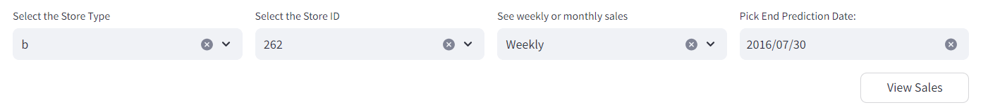
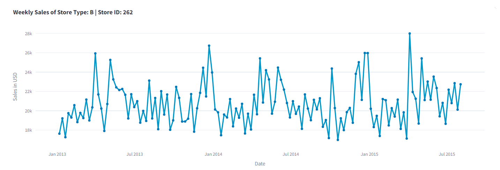
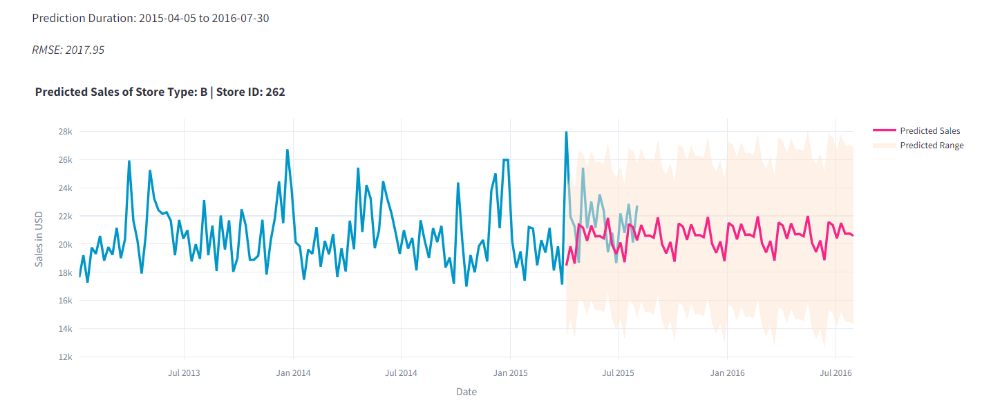

# Streamlit Application: Rossmann Sales Prediction using SARIMAX, Prophet

Welcome to the Rossmann Sales Prediction App! 🚀 This application leverages SARIMA and Prophet models to predict monthly and weekly sales up to a year based on the Rossman Sales data.

### SARIMA

To predict sales using SARIMA, select the `store_type`, `store_id`, and choose whether you want to display weekly or monthly sales predictions. Enter the end prediction date, and the app will provide you with historical sales data and predicted sales data until the specified end date.

1. Customize your options
   

2. View hisorical sales

   

3. View Predicted Sales

   

### Prophet

To predict sales using PROPHET, select the store ID, and choose the duration for which you want to forecast sales beginning from a date. Choose the dates in that duration for which you want to offer a promotion and the days that are going to be holidays.Based on the historical data, the app will forecast sales for the specified duration.

Explore sales trends, make informed decisions, and plan for the future using the power of predictive analytics! 📊💡

Feel free to navigate through the app and make predictions based on different scenarios. Happy forecasting! 🌐🔮

To predict sales using Prophet, select the `store_id`, `date`, `number of days you want to forecast the sale`, `promotion` and the dates of promotions, `holidays` and dates of the holidays.
